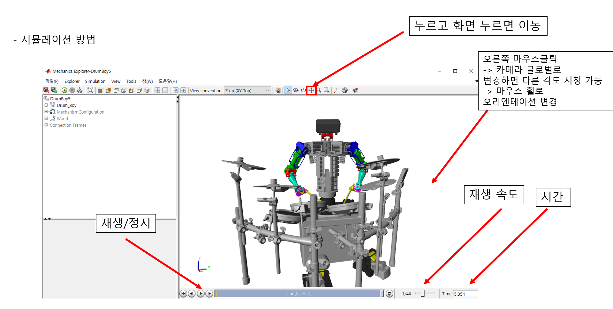

# DrumRobot1 KIST 인공지능연구단 드럼연주로봇 MOFFET

## Sheets creation - Action generation (simulation) - System execution 
**악보만들기-동작생성(시뮬레이션)-시스템 실행**
- 악보작성
* 주의 사항: 너무 빠른 곡은 불가능, bpm고려하여 제일 빠른 연음으로 시간계산
(드럼로봇의 한 손이 가장 끝에서 끝으로 드럼타격을 할 때 300msec 내외로 되는 곡만 가능)

- MuseScore로 악보작성하기
* 유용한 단축키
1. N -> 드럼셋 음표 삽입
2. delete 지우기
3. 음표 선택 후 ctrl+L -> 가사 삽입(spacebar 다음 음표이동, ctrl+spacebar 띄어쓰기)
4. ctrl+3 3잇단음표

- 악보 생성시 참고할 점
크래시가 왠만하면 악보 맨 앞으로 오도록 맞춘다.
꾸밈음에 보면 전타음 있음
오픈 하이햇 하고 클로즈 하이햇 햇갈리니까 조심하기

---

---

- 악보 작성 시 체크사항

* 100BPM 단위로 작성을 한 경우 각 마디를 잘 작성했다면 0.6으로 나눠주었을 때 정수가 나와야지 정상
* 텍스트 파일로 변환 시 텍스트 파일만 보고서는 오류를 찾기 매우 힘들기 때문에 8마디 정도에 한 번씩은 매트랩으로 검산 필요!

MATLAB 명령어
data = load(“작업중인파일.txt”)
(sum(data(1:12,2))/0.6 – 1) / 4 = 마디수 // 12는 끝 마디, 100bpm일 때 0.6으로 설정
정수로 떨어지더라도 마디 수 가 맞지 않을 수도 있음. 마디 수 잘 세면서 확인하기
*이때 .txt파일의 맨 위에 bpm 값을 적어주었다면 지워야 파일을 ASCII 값으로 인식함.

- Playlist 만드는 법
playlist.txt파일을 구동시키려면 -> playlist파일에 원하는 곡들 추가하는 방식으로 작동
다음 사진과 같음

---

-형식-
code = ‘내가만든.txt’; N = 총 마디 개수;
bpm = [시작마디 bpm];

**가장 최신 시뮬레이션 (.m) 파일 = Main3_BeatDrum56.m**
readme.txt파일에 각 버전별 파일 관리 되어있음

---

플레이할 곡을 Main.m파일의 코드에 작성, 원하는 마디 수 값을 N에 넣어주어 수행가능. ( < N까지 수행)

- 시뮬레이션 운영

---

- 시뮬레이션을 끊어서 돌리는 방법
bSpan = [시작마디 종료마디] => 변경 후 시뮬레이션 방식

주로 8마디 정도씩 끊어서 시뮬레이션을 하고 꼭 필인 부분들은 꼼꼼하게 확인을 해야 함.

ps. 전에 실행한 부분이 일부분 겹쳐야지 reRun코드를 실행 할 수 있다.
ex) 메인 코드에서 1-30마디까지 수행하였다면 rerun코드에서는 10- 40 , 30-50 이런 범위는 가능하지만 31 – 50, 36-59 이런 범위는 불가능하다. 시뮬레이션이 이어지지 않기 때문임.

- <버전 숫자에 대한 이해>
-57,56 버전을 실행하기 위해서 
메인코드 56 사용
-55 버전을 실행하기 위해서 
메인코드 55사용
-52,53,54, 버전을 실행하기 위해서 
메인코드 52 사용

버전 숫자보다 낮지만 보유하고 있는 
제일 높은 메인코드 버전을 사용하면 된다.
readme.txt 파일을 참고하면 버전별 차이점을 알 수있다.

- 시뮬레이션 조작 법

---

- Simulation Analysis // 시뮬레이션 분석 법

---

---

---

---

치는 세기는 알고리즘이 정해주는데 0.001로 대부분나옴
이때 format long 한 후에 다시 실행시키면 소수점 자리 더 밑에까지 나오는데 1 밑에 있는 숫자가 damping 계수 같은거임 클수록 더 못들고 작을수록 더 들게 되는거 이를 확인

- Simulation over // 시뮬레이션이 끝난 후

---

모펫 구동방법 27page는 **27page라고 아래에 적어둠

---

## Management & Maintenance // 운영 & 유지보수

** MOFFET Operation // 모펫 구동 **

---

---

---

---

---

---

---

**위 사진이 모펫 구동방법 27page임**

---

---

- 추가 사항

---

### 🎥 **Check out the drum robot video playlist here:** [**Drum Robot MOFFET Video Playlist Link**](https://www.youtube.com/playlist?list=PLtY0U6vQitshk1aGB5-GP7AsMbrjW-Ptf)

## License
State the license under which the project is available. Example: This project is licensed under the MIT License - see the LICENSE.md file for details.
